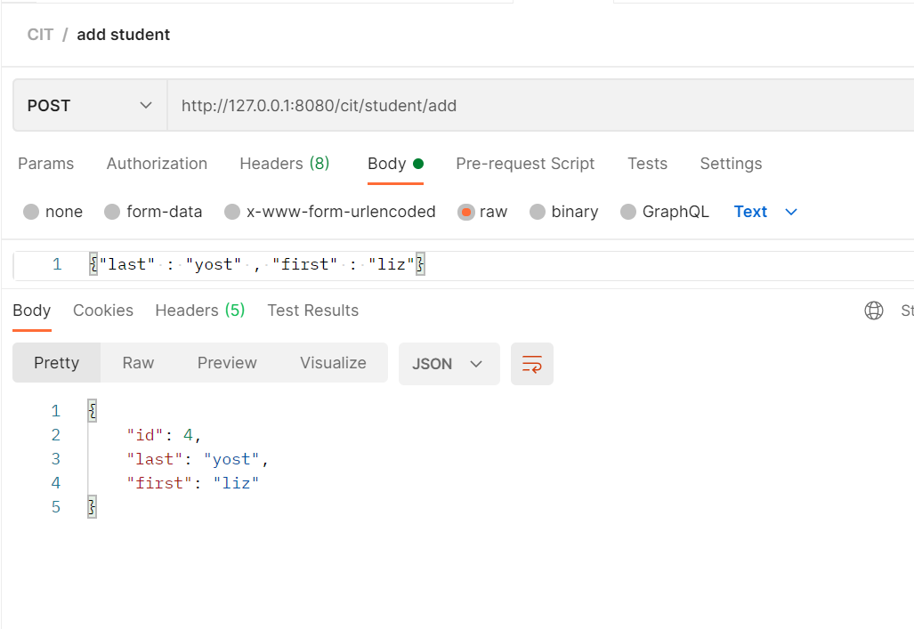
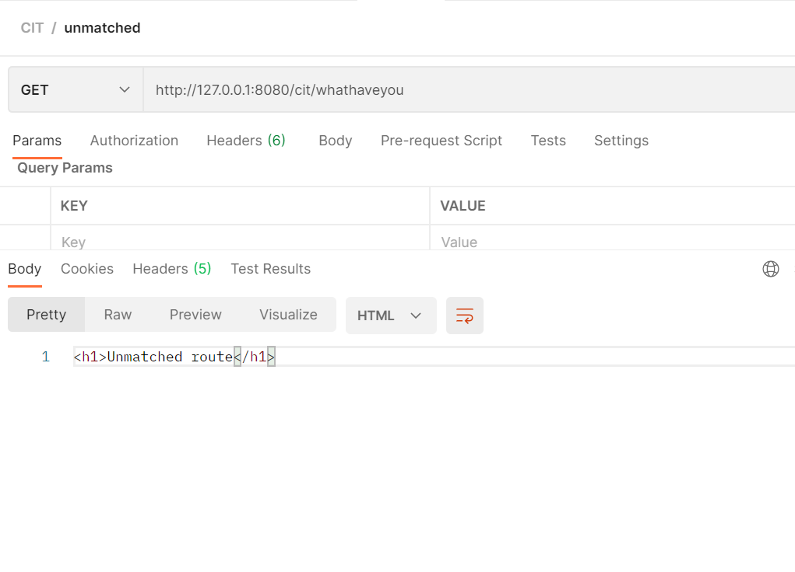

## Techniques Used 

- Use Postman to test server routes
- Non-web server Node.js JavaScript code
    - Lambda expressions
    - for...of statments
    - Tenary operater
    - JSON.parse() method 
    - if...else statments
    - template literals
- Web server Node.js JavaScript code
  - Installing fastify
  - Initializing as a node.js file
  - Using http "GET" and "POST" verbs
  - Utilizing the json and html MIME type
  - Returning a status code
  - Responding to client requests and handling query parameters
  - Handle an unmatched route

## Objectives


### Update server code to handle requests from the client. Return information from the "student" array as JSON or add a new student.
```
const students = [
    {
      id: 1,
      last: "Last1",
      first: "First1",
    },
    {
      id: 2,
      last: "Last2",
      first: "First2",
    },
    {
      id: 3,
      last: "Last3",
      first: "First3",
    }
  ];

// Require the Fastify framework and instantiate it
const fastify = require("fastify")();
// Handle GET verb for / route using Fastify
// Note use of "chain" dot notation syntax
fastify.get("/cit/student", (request, reply) => {
  reply
    .code(200)
    .header("Content-Type", "application/json; charset=utf-8")
    .send(students);
});

//new route
fastify.get("/cit/student/:id", (request, reply) => {
    let studentIDFromClient = request.params.id;
    let studentToSendToClient = null;
    for(studentInArray of students) {
        if(studentInArray.id == studentIDFromClient) {
        studentToSendToClient = studentInArray;
        break;
    }
}
if (studentToSendToClient != null){
    reply
      .code(200)
      .header("Content-Type", "application/json; charset=utf-8")
      .send(studentToSendToClient);
}else{
    reply
    .code(200)
    .header("Content-Type", "text/html; charset=utf-8")
    .send("Could not find student with given id.");
}
  });

  //new route
fastify.get("*", (request, reply) => {
    reply
      .code(200)
      .header("Content-Type", "text/html; charset=utf-8")
      .send(`<h1>Unmatched route</h1>`);
  });

  fastify.post("/cit/student/add", (request, reply) => {
      let objectFromClient = JSON.parse(request.body);
      console.log(objectFromClient);

      let maxID = 0;
      for (individualStudent of students) {
        if(maxID < individualStudent.id) {
          maxID = individualStudent.id;
        }
      }

     let genteratedStudent = {
        id: maxID + 1,
      last: objectFromClient.last,
      first: objectFromClient.first,
      }; 

      students.push(genteratedStudent);

    reply
      .code(200)
      .header("Content-Type", "application/json; charset=utf-8")
      .send(genteratedStudent);

  });

// Start server and listen to requests using Fastify
const listenIP = "localhost";
const listenPort = 8080;
fastify.listen(listenPort, listenIP, (err, address) => {
  if (err) {
    console.log(err);
    process.exit(1);
  }
  console.log(`Server listening on ${address}`);
});

```


### Test routes with Postman  

Route responses:






Node.js configuration file:

[package.json](https://lizz02.github.io/cit281-lab04/package.json)
